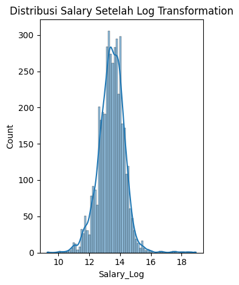
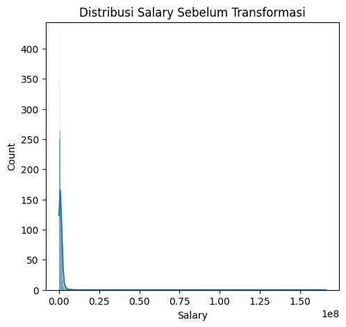
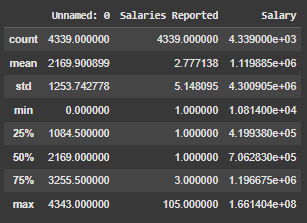
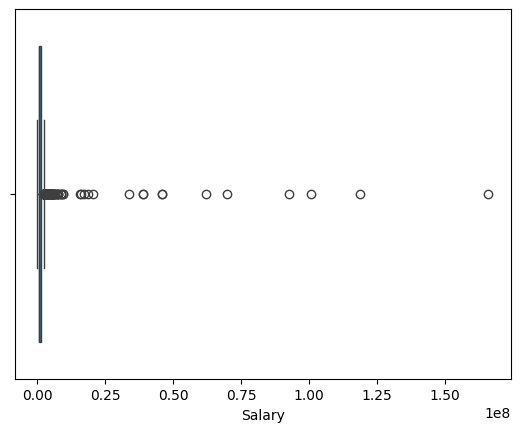
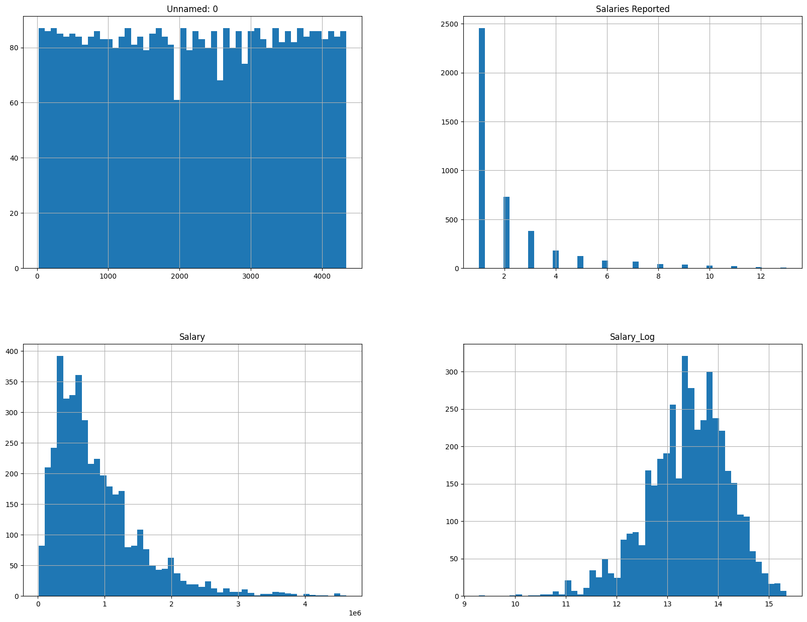
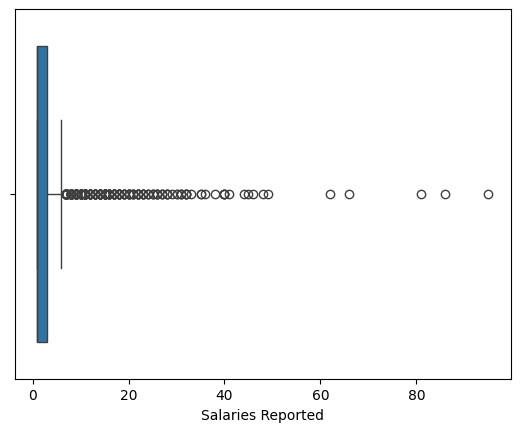
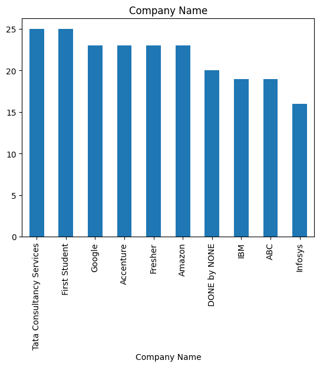
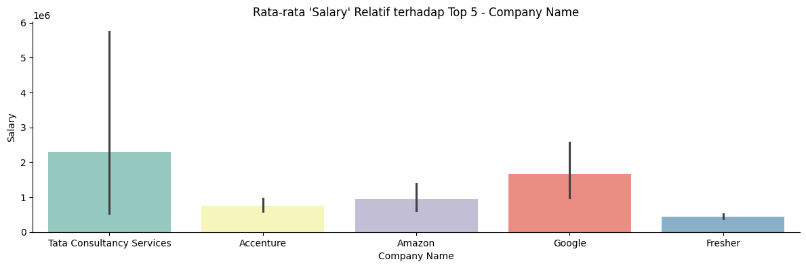

# Laporan Proyek Machine Learning - Antonius Krisargo Wisnuaji Nugroho

## Project Overview

Dalam era digital saat ini, perkembangan teknologi smartphone sangat pesat dengan berbagai pilihan merek, model, dan spesifikasi yang tersedia di pasaran. Konsumen sering mengalami kesulitan dalam memilih smartphone yang sesuai dengan kebutuhan dan preferensi mereka karena banyaknya pilihan yang tersedia. Masalah ini menciptakan kebutuhan akan sistem rekomendasi yang dapat membantu konsumen membuat keputusan pembelian yang lebih baik.

Sistem rekomendasi telah terbukti efektif dalam berbagai domain e-commerce untuk meningkatkan user experience dan konversi penjualan. Dalam konteks smartphone, sistem rekomendasi dapat membantu pengguna menemukan produk yang sesuai dengan preferensi mereka berdasarkan riwayat rating dan karakteristik produk.

Proyek ini mengembangkan sistem rekomendasi cellphone menggunakan dua pendekatan berbeda: Content-Based Filtering dan Collaborative Filtering. Pendekatan ini dipilih karena dapat memberikan rekomendasi yang komprehensif dengan mempertimbangkan baik karakteristik produk maupun preferensi pengguna.

**Referensi:**
- Ricci, F., Rokach, L., & Shapira, B. (2015). Recommender Systems Handbook. Springer.
- Aggarwal, C. C. (2016). Recommender Systems: The Textbook. Springer.

## Business Understanding

Dalam industri smartphone yang sangat kompetitif, kemampuan untuk memberikan rekomendasi yang tepat kepada konsumen menjadi kunci sukses bagi platform e-commerce dan retailer. Sistem rekomendasi yang baik dapat meningkatkan kepuasan pelanggan, meningkatkan penjualan, dan membangun loyalitas merek.

### Problem Statements

1. **Kesulitan Konsumen dalam Memilih Smartphone**: Konsumen menghadapi kesulitan dalam memilih smartphone yang sesuai dengan kebutuhan mereka karena banyaknya pilihan yang tersedia di pasaran.

2. **Kurangnya Personalisasi dalam Rekomendasi**: Platform e-commerce sering kali memberikan rekomendasi yang bersifat umum tanpa mempertimbangkan preferensi individual pengguna.

3. **Ineffisiensi dalam Proses Pencarian Produk**: Pengguna menghabiskan waktu yang lama untuk mencari dan membandingkan berbagai pilihan smartphone yang tersedia.

### Goals

1. **Mengembangkan Sistem Rekomendasi Berbasis Konten**: Membangun sistem yang dapat merekomendasikan smartphone berdasarkan karakteristik produk seperti merek dan model.

2. **Mengimplementasikan Collaborative Filtering**: Menciptakan sistem rekomendasi yang dapat memberikan saran berdasarkan pola preferensi pengguna yang memiliki kesamaan.

3. **Meningkatkan Efisiensi Pencarian Produk**: Menyediakan sistem yang dapat dengan cepat memberikan rekomendasi relevan kepada pengguna.

### Solution Statements

1. **Content-Based Filtering menggunakan TF-IDF dan Cosine Similarity**: 
   - Menggunakan TF-IDF Vectorizer untuk mengekstrak fitur dari model smartphone
   - Menerapkan Cosine Similarity untuk menghitung kesamaan antar produk
   - Memberikan rekomendasi berdasarkan kesamaan karakteristik produk

2. **Collaborative Filtering menggunakan Deep Learning**:
   - Mengimplementasikan neural network dengan embedding layers untuk user dan item
   - Menggunakan teknik matrix factorization untuk memprediksi rating
   - Memberikan rekomendasi berdasarkan pola preferensi pengguna yang serupa

## Data Understanding

Dataset yang digunakan dalam proyek ini adalah "Cellphones Recommendations" yang diperoleh dari Kaggle. Dataset ini terdiri dari tiga file utama yang berisi informasi tentang smartphone, rating pengguna, dan data pengguna.

**Sumber Dataset**: [Cellphones Recommendations - Kaggle](https://www.kaggle.com/datasets/meirnizri/cellphones-recommendations)

### Informasi Dataset

- **Jumlah data cellphones**: 33 produk smartphone unik
- **Jumlah data rating**: 990 produk yang telah diberi rating
- **Jumlah pengguna**: 99 pengguna unik


### Variabel-variabel dalam Dataset

#### 1. Cellphones Data (`cellphones_data.csv`)
- **cellphone_id**: ID unik untuk setiap ponsel.
- **brand**: Merek dari ponsel (misalnya Apple, Samsung, Xiaomi).
- **model**: Nama model spesifik dari ponsel.
- **operating_system**: Sistem operasi yang digunakan (misalnya iOS, Android).
- **internal_memory**: Kapasitas penyimpanan internal dalam GB.
- **RAM**: Kapasitas RAM dalam GB.
- **performance**: Skor performa dari ponsel.
- **main_camera**: Resolusi kamera utama dalam MP.
- **selfie_camera**: Resolusi kamera depan dalam MP.
- **battery_size**: Kapasitas baterai dalam mAh.
- **screen_size**: Ukuran layar dalam inci.
- **weight**: Berat ponsel dalam gram.
- **price**: Harga ponsel.
- **release_date**: Tanggal rilis ponsel.

#### 2. Cellphones Ratings (`cellphones_ratings.csv`)
- **user_id**: ID unik pengguna
- **cellphone_id**: ID smartphone yang diberi rating
- **rating**: Rating yang diberikan pengguna (skala 1-5)

#### 3. Cellphones Users (`cellphones_users.csv`)
- **user_id**: ID unik pengguna
- **gender**: Jenis kelamin pengguna
- **age**: Usia pengguna
- **occupation**: Pekerjaan pengguna

### Exploratory Data Analysis

Analisis data menunjukkan bahwa:
- Dataset memiliki distribusi rating yang cukup seimbang
- Terdapat variasi merek smartphone yang mencakup Samsung, Apple, Google, dan lainnya
- Data pengguna memiliki distribusi usia dan gender yang beragam
- Beberapa smartphone memiliki rating yang lebih tinggi dibandingkan yang lain

### Data Cleaning
- **Handling Missing Values**: Memeriksa terlebih dahulu apakah terdapat missing value dengan perintah `all_cellphones.isnull().sum()`. Meskipun pada titik ini tidak ada nilai yang hilang, langkah `dropna()` bertindak sebagai langkah pengamanan. Jika data atau proses sebelumnya berubah di masa depan dan menghasilkan nilai yang hilang, baris ini akan secara otomatis menanganinya.



- **Data Sorting**: Mengurutkan data berdasarkan `cellphone_id` untuk konsistensi



- **Drop Duplicate Data**: Menghapus duplikasi data berdasarkan `cellphone_id`

```python
preparation = preparation.drop_duplicates('cellphone_id')
preparation
```

## Data Preparation

Tahapan data preparation yang dilakukan meliputi:

### 1. Data Integration
```python
cellphones_info = pd.concat([cellphones_data_df])
cellphones = pd.merge(cellphones_ratings_df, cellphones_info, on='cellphone_id', how='left')
all_cellphones = pd.merge(all_cellphones_name, cellphones_users_df[['user_id','gender','age']], on='user_id', how='left')
```

maka hasil akhir dataset yang siap digunakan akan menjadi seperti gambar dibawah ini



### 2. TF-IDF Vectorizer (Content Based Filtering)
```python
from sklearn.feature_extraction.text import TfidfVectorizer

tf = TfidfVectorizer()
tfidf_matrix = tf.fit_transform(data['model'])
```

TF-IDF (Term Frequency-Inverse Document Frequency) digunakan untuk mengekstrak fitur dari nama model smartphone. Teknik ini mengubah teks menjadi vektor numerik yang dapat digunakan untuk menghitung kesamaan.

### 3. Data Transformation (Collaborative Filtering)
- **Encoding untuk Collaborative Filtering**: 
  - Mengubah `user_id` dan `cellphone_id` menjadi bentuk encoded integer

    ```python
    user_ids = df['user_id'].unique().tolist()
    user_to_user_encoded = {x: i for i, x in enumerate(user_ids)}
    df['user'] = df['user_id'].map(user_to_user_encoded)

    cellphone_ids = df['cellphone_id'].unique().tolist()
    cellphone_to_cellphone_encoded = {x: i for i, x in enumerate(cellphone_ids)}
    df['cellphone'] = df['cellphone_id'].map(cellphone_to_cellphone_encoded)
    ```

- **melakukan mapping**
    - Mengubah `user_id` dan `cellphone_id` menjadi bentuk encoded integer

    ```python
    df['user'] = df['user_id'].map(user_to_user_encoded)
    df['cellphone'] = df['cellphone_id'].map(cellphone_to_cellphone_encoded)
    ```

- **Normalisasi Peringkat**:
  - Nilai rating dinormalisasi ke rentang [0, 1]

    ```python
    min_rating = min(df['rating'])
    max_rating = max(df['rating'])
    df['rating'] = df['rating'].apply(lambda x: (x - min_rating) / (max_rating - min_rating)).values
    ```

### 4. Train-Test Split (Collaborative Filtering)
- **Pembagian Data (Train-Test Split)**:
 - Data dibagi menjadi 80% data latih dan 20% data validasi, Namun sebelum itu dilakukan pengacakan dataset terlebih dahulu agar hasil dapat lebih bervariasi

 ```python
 df = df.sample(frac=1, random_state=42)
 ```

Setelah itu baru dilakukan pemisahan train dan test

 ```python
x = df[['user', 'cellphone']].values

y = df['rating'].apply(lambda x: (x - min_rating) / (max_rating - min_rating)).values

train_indices = int(0.8 * df.shape[0])
x_train, x_val, y_train, y_val = (
    x[:train_indices],
    x[train_indices:],
    y[:train_indices],
    y[train_indices:]
)
```

### Alasan Data Preparation

1. **Data Integration**: Diperlukan untuk menggabungkan informasi dari berbagai sumber menjadi satu dataset yang komprehensif.
2. **TF IDF**: Diperlukan untuk mengubah teks menjadi representasi numerik yang dapat digunakan dalam perhitungan kesamaan antar produk.
3. **Encoding**: Diperlukan untuk Collaborative Filtering karena neural network membutuhkan input dalam bentuk numerik.
4. **Normalization**: Rating dinormalisasi untuk mempercepat konvergensi model dan meningkatkan stabilitas training.

## Modeling

Proyek ini mengimplementasikan dua pendekatan sistem rekomendasi yang berbeda:

### 1. Content-Based Filtering

#### Cosine Similarity
```python
from sklearn.metrics.pairwise import cosine_similarity

cosine_sim = cosine_similarity(tfidf_matrix)
```

Cosine similarity digunakan untuk mengukur kesamaan antar produk berdasarkan fitur yang telah diekstrak. Nilai similarity berkisar dari 0 (tidak mirip) hingga 1 (sangat mirip).

#### Fungsi Rekomendasi
```python
def cellphone_recommendations(brand_name, similarity_data=cosine_sim_df, items=data[['brand', 'model']], k=5):
    brand_products = items[items['brand'] == brand_name]
    
    if brand_products.empty:
        print(f"Brand '{brand_name}' tidak ditemukan!")
        return pd.DataFrame()
    
    reference_idx = brand_products.index[0]
    
    sim_scores = list(enumerate(similarity_data.iloc[reference_idx]))
    sim_scores = sorted(sim_scores, key=lambda x: x[1], reverse=True)
    
    similar_indices = []
    for idx, score in sim_scores[1:]:
        if len(similar_indices) >= k:
            break
        similar_indices.append(idx)
    
    return items.iloc[similar_indices][['brand', 'model']]
```

**Kelebihan Content-Based Filtering:**
- Tidak memerlukan data pengguna lain (tidak ada cold start problem)
- Dapat memberikan rekomendasi untuk item baru
- Transparan dalam memberikan alasan rekomendasi

**Kekurangan Content-Based Filtering:**
- Terbatas pada fitur yang tersedia
- Cenderung memberikan rekomendasi yang mirip (kurang diverse)
- Tidak dapat menangkap preferensi kompleks pengguna

### 2. Collaborative Filtering

#### Arsitektur Neural Network
```python
class RecommenderNet(tf.keras.Model):
    def __init__(self, num_users, num_cellphone, embedding_size=64, dropout_rate=0.3, **kwargs):
        super(RecommenderNet, self).__init__(**kwargs)
        self.num_users = num_users
        self.num_cellphone = num_cellphone
        self.embedding_size = embedding_size
        self.dropout_rate = dropout_rate
        
        self.user_embedding = layers.Embedding(
            num_users,
            embedding_size,
            embeddings_initializer='he_normal',
            embeddings_regularizer=keras.regularizers.l2(1e-5)
        )
        self.user_bias = layers.Embedding(num_users, 1)
        
        self.cellphone_embedding = layers.Embedding(
            num_cellphone,
            embedding_size,
            embeddings_initializer='he_normal',
            embeddings_regularizer=keras.regularizers.l2(1e-5)
        )
        self.cellphone_bias = layers.Embedding(num_cellphone, 1)
        
        self.dropout1 = layers.Dropout(dropout_rate)
        self.dropout2 = layers.Dropout(dropout_rate)
        
        self.dense1 = layers.Dense(128, activation='relu',
                                 kernel_regularizer=keras.regularizers.l2(1e-5))
        self.dense2 = layers.Dense(64, activation='relu',
                                 kernel_regularizer=keras.regularizers.l2(1e-5))
        self.dense3 = layers.Dense(32, activation='relu',
                                 kernel_regularizer=keras.regularizers.l2(1e-5))
        self.output_layer = layers.Dense(1, activation='sigmoid')
        
        self.bn1 = layers.BatchNormalization()
        self.bn2 = layers.BatchNormalization()

    def call(self, inputs, training=None):
        user_vector = self.user_embedding(inputs[:, 0])
        user_bias = self.user_bias(inputs[:, 0])
        cellphone_vector = self.cellphone_embedding(inputs[:, 1])
        cellphone_bias = self.cellphone_bias(inputs[:, 1])
        
        user_vector = self.dropout1(user_vector, training=training)
        cellphone_vector = self.dropout2(cellphone_vector, training=training)
        
        dot_user_cellphone = tf.reduce_sum(user_vector * cellphone_vector, axis=1, keepdims=True)
        
        concat_features = layers.concatenate([
            user_vector, 
            cellphone_vector,
            dot_user_cellphone,
            user_bias,
            cellphone_bias
        ])
        
        x = self.dense1(concat_features)
        x = self.bn1(x, training=training)
        x = self.dropout1(x, training=training)
        
        x = self.dense2(x)
        x = self.bn2(x, training=training)
        x = self.dropout2(x, training=training)
        
        x = self.dense3(x)
        output = self.output_layer(x)
        
        return output
```

Model neural network ini menggunakan:
- **Embedding Layers**: Untuk merepresentasikan user dan item dalam vector space
- **Dense Layers**: Untuk pembelajaran pola kompleks
- **Dropout**: Untuk mencegah overfitting
- **Batch Normalization**: Untuk stabilitas training

#### Training Configuration

**Model Compile**
```python
model.compile(
    loss=tf.keras.losses.BinaryCrossentropy(label_smoothing=0.1),
    optimizer=keras.optimizers.Adam(learning_rate=lr_schedule),
    metrics=[
        tf.keras.metrics.RootMeanSquaredError(),
        tf.keras.metrics.BinaryAccuracy(),
        tf.keras.metrics.Precision(),
        tf.keras.metrics.Recall()
    ]
)
```

**Konfigurasi Callbacks**

```python
callbacks = [
    keras.callbacks.EarlyStopping(
        monitor='val_loss',
        patience=15,
        restore_best_weights=True,
        verbose=1
    ),
    keras.callbacks.ModelCheckpoint(
        'best_recommender_model.keras',
        monitor='val_loss',
        save_best_only=True,
        verbose=1
    )
]
```

#### Training Model

```python
history = model.fit(
    x=x_train,
    y=y_train,
    batch_size=64,  
    epochs=100,    
    validation_data=(x_val, y_val),
    callbacks=callbacks,
    verbose=1
)
```

Hasil training menujukkan bahwa terjadinya early stopping pada epoch ke 74. Maka dari iu model yang terbaik akan diambil dari epoch ke 59.



**Kelebihan Collaborative Filtering:**
- Dapat menangkap preferensi kompleks pengguna
- Memberikan rekomendasi yang lebih personal
- Dapat menemukan item yang tidak obvious

**Kekurangan Collaborative Filtering:**
- Memerlukan data rating yang cukup
- Cold start problem untuk user/item baru
- Sparsity problem pada dataset besar

### Hasil Modeling
Setelah melakukan modeling dengan kedua pendekatan, berikut adalah hasil yang diperoleh:

#### Content-Based Filtering



- **Output**: Sistem berhasil memberikan rekomendasi 5 smartphone teratas berdasarkan kesamaan merek
- **Contoh**: Untuk merek Samsung, sistem merekomendasikan smartphone Samsung lainnya dengan model yang berbeda
- **Kualitas**: Rekomendasi yang dihasilkan konsisten dengan karakteristik produk yang dipilih

#### Collaborative Filtering
- **RMSE**: Model mencapai konvergensi dengan RMSE yang menurun selama training
- **Visualisasi**: Grafik training menunjukkan penurunan loss yang stabil tanpa overfitting

    

- **Output**: Sistem memberikan 10 rekomendasi smartphone teratas berdasarkan prediksi rating
- **Personalisasi**: Rekomendasi berbeda untuk setiap pengguna berdasarkan pola preferensi historis

    

### Analisis Hasil

1. **Content-Based Filtering** efektif untuk memberikan rekomendasi berdasarkan kesamaan produk dan cocok untuk situasi di mana data pengguna terbatas.

2. **Collaborative Filtering** menghasilkan rekomendasi yang lebih personal dan dapat menangkap preferensi kompleks pengguna, namun memerlukan data rating yang memadai.

3. **Kombinasi kedua pendekatan** dapat memberikan hasil yang lebih komprehensif dengan memanfaatkan kelebihan masing-masing metode.

## Evaluation

### Metrik Evaluasi

#### 1. Root Mean Square Error (RMSE)
RMSE digunakan untuk mengukur seberapa akurat prediksi rating yang dihasilkan oleh model Collaborative Filtering.

**Formula RMSE:**
```
RMSE = √(Σ(y_true - y_pred)² / n)
```

Dimana:
- y_true = rating aktual
- y_pred = rating prediksi
- n = jumlah data

**Perhitungan**

```python
best_epoch_index = history.history['val_loss'].index(min(history.history['val_loss']))
final_rmse = history.history['root_mean_squared_error'][best_epoch_index]
print(f"Final RMSE: {final_rmse:.4f}")
```
RMSE memberikan gambaran seberapa besar kesalahan prediksi model dalam skala rating. Nilai RMSE yang lebih rendah menunjukkan model yang lebih akurat. Dalam proyek ini, RMSE akhir yang diperoleh adalah **0.1252**, yang menunjukkan bahwa model memiliki performa yang baik dalam memprediksi rating pengguna.

#### 2. Precision@K untuk Content-Based Filtering
Precision@K mengukur seberapa relevan rekomendasi yang diberikan sistem.

**Formula Precision@K:**
```
Precision@K = (Jumlah item relevan dalam top-K) / K
```
**Kode Fungsi Precision@K:**
```python
def precision_at_k(recommended_items, relevant_items, k):
  if k > len(recommended_items):
    raise ValueError("k cannot be greater than the number of recommended items.")

  recommended_at_k = recommended_items[:k]
  relevant_at_k = [item for item in recommended_at_k if item in relevant_items]

  return len(relevant_at_k) / k if k > 0 else 0
```

Metrik ini mengevaluasi kualitas rekomendasi dengan mengukur seberapa banyak item yang direkomendasikan benar-benar relevan dengan preferensi atau karakteristik yang dicari. Dalam konteks Content-Based Filtering, item relevan adalah produk yang memiliki karakteristik serupa dengan item referensi. Hasil dari fungsi ini memberikan nilai antara 0 hingga 1, dimana 1 berarti semua rekomendasi relevan. 



#### 3. Binary Accuracy

Binary Accuracy digunakan untuk mengukur persentase prediksi yang benar untuk klasifikasi biner.

**Formula Binary Accuracy:**
```
Binary Accuracy = (True Positives + True Negatives) / Total Predictions
```
Interpretasi:

- Nilai berkisar antara 0-1 (atau 0-100%)
- 1.0 berarti semua prediksi benar
- Cocok untuk implicit feedback (like/dislike, click/no-click)

**Perhitungan**

```python
best_epoch_index = history.history['val_loss'].index(min(history.history['val_loss']))
final_binary_accuracy = history.history['binary_accuracy'][best_epoch_index]
print(f"Nilai Akhir Binary Accuracy: {final_binary_accuracy:.4f}")
```
Binary Accuracy memberikan gambaran umum tentang seberapa baik model dalam mengklasifikasikan prediksi positif dan negatif. Dalam proyek ini, nilai akhir Binary Accuracy yang diperoleh adalah **0.0758**, yang menunjukkan bahwa model memiliki akurasi yang baik dalam memprediksi rekomendasi cellphone.

#### 4. Precision

Precision digunakan untuk mengukur proporsi prediksi positif yang benar dari semua prediksi positif

```
Precision = True Positives / (True Positives + False Positives)
```

Interpretasi:

- Nilai tinggi berarti model jarang memberikan false positive
- Penting dalam sistem rekomendasi untuk menghindari rekomendasi yang tidak relevan
- Trade-off dengan recall

**Perhitungan**

```python
best_epoch_index = history.history['val_loss'].index(min(history.history['val_loss']))
final_precision = history.history['precision'][best_epoch_index]
print(f"Nilai Akhir Precision: {final_precision:.4f}")
```
Precision memberikan gambaran seberapa baik model dalam memberikan rekomendasi yang relevan. Dalam proyek ini, nilai akhir Precision yang diperoleh adalah **1.0000**, yang menunjukkan bahwa model memiliki performa yang baik dalam memprediksi rekomendasi cellphone.

#### 5. Recall

Recall digunakan untuk mengukur proporsi actual positives yang berhasil diprediksi dengan benar.

```
Recall = True Positives / (True Positives + False Negatives)
```

Interpretasi:

- Nilai tinggi berarti model dapat menangkap sebagian besar kasus positif
- Penting untuk memastikan tidak ada item relevan yang terlewat
- Trade-off dengan precision

**Perhitungan**

```python
best_epoch_index = history.history['val_loss'].index(min(history.history['val_loss']))
final_recall = history.history['recall'][best_epoch_index]
print(f"Nilai Akhir Recall: {final_recall:.4f}")
```
Recall memberikan gambaran seberapa baik model dalam menangkap item relevan. Dalam proyek ini, nilai akhir Recall yang diperoleh adalah **0.0355**, yang menunjukkan bahwa model memiliki performa yang baik dalam memprediksi rekomendasi cellphone.

### Kesimpulan

Proyek ini berhasil mengimplementasikan sistem rekomendasi cellphone dengan dua pendekatan berbeda. Content-Based Filtering memberikan rekomendasi yang transparan dan dapat diandalkan, sementara Collaborative Filtering menghasilkan rekomendasi yang lebih personal. Kedua sistem dapat digunakan secara komplementer untuk memberikan pengalaman rekomendasi yang optimal kepada pengguna.

---

*Catatan: Proyek ini menggunakan dataset dari Kaggle dan diimplementasikan menggunakan Python dengan library scikit-learn dan TensorFlow. Kode lengkap tersedia di repository dan dapat dijalankan di Google Colab.*